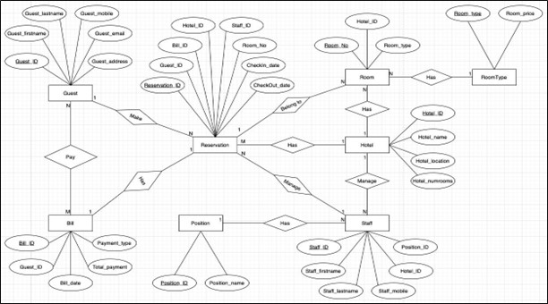
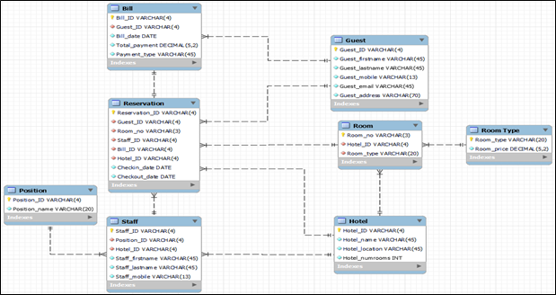
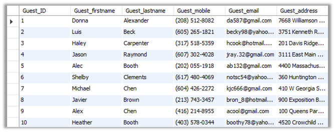
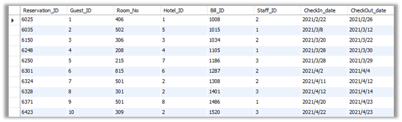
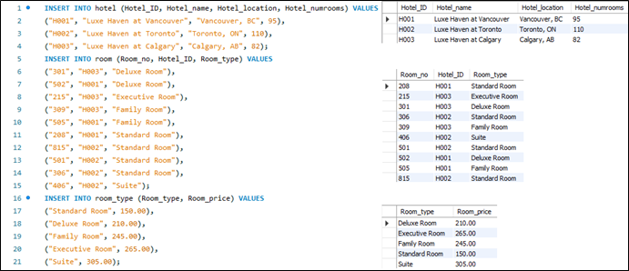
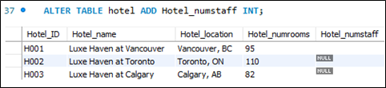
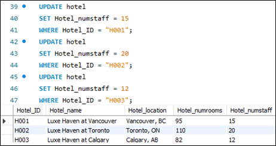
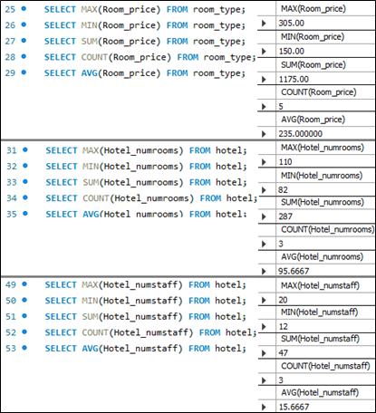
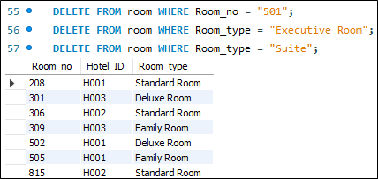

# S-Project 1: Hotel Management Database Design, Normalization & SQL Operations (MySQL)

This project consists of the full lifecycle of designing and implementing a **Hotel Management System database**.  
Across three stages, we built an ERD, created tables, populated data, normalized the schema to 3NF,  
and practiced core SQL operations (DDL, DML, DQL).

**This project merges three assignments:**
1. **Database Creation (ERD → MySQL Workbench)**  
2. **Normalization to 3NF (No anomalies, dependency checks)**  
3. **SQL Command Practice (INSERT, UPDATE, ALTER, DELETE, AGGREGATES)**  

* **Tools:** MySQL Workbench, SQL, ERD/EERD modeling  
* **Techniques:** ERD design, table creation, primary/foreign keys, 1NF–3NF normalization, SQL CRUD, aggregate queries  
* **Goal:** Build a fully functional, clean, normalized relational database for hotel operations.

---

# 🧱 **1. Database Design**  

We designed an end-to-end relational schema for a hotel system.  
Entities include:

- **Guest**  
- **Hotel**  
- **Room Type**  
- **Room**  
- **Staff**  
- **Position**  
- **Bill**  
- **Reservation** (central linking table)

### ✔ ERD (Conceptual Model)

  
  
<em>Original ERD showing 8 entities and their relationships.</em>

### ✔ EERD (MySQL Workbench – Logical Model)

  
  
<em>MySQL Workbench auto-generated EERD with PK/FK constraints.</em>

### Key Design Features
- Primary keys defined for all tables  
- Foreign keys connecting Guest ↔ Reservation ↔ Room ↔ Staff ↔ Bill  
- All attributes assigned appropriate data types (INT, VARCHAR, DECIMAL, DATE)  
- Clean 1-to-many and many-to-one relationships  

This schema allows a hotel to track guests, reservations, rooms, staff roles, and billing.

---

# 🧹 **2. Normalization to 3NF**  

We validated that the entire schema is already in:

### ✔ **1NF**
- No repeating groups  
- Atomic values  
- Primary keys clearly defined  

### ✔ **2NF**
- All non-key attributes depend fully on the PK  
- No partial dependencies  

### ✔ **3NF**
- No transitive dependencies  
- All attributes depend **only** on their table’s primary key  

### Example: **Guest Entity**

  
  
<em>Guest entity attributes demonstrate full functional dependency.</em>

### Example: **Reservation Entity**  
The most important central table linking five foreign keys.

  
  
<em>Reservation table cleanly meets 1NF–3NF rules.</em>

---

# 🧪 **3. SQL Operations**  

We practiced essential SQL commands including:

- `INSERT INTO`  
- `UPDATE`  
- `ALTER TABLE`  
- `DELETE`  
- `SELECT + AGGREGATES (MAX, MIN, SUM, COUNT, AVG)`  

Each exercise was done with sample data inserted into the **Room, Room_Type, and Hotel** tables.

---

### 📝 **INSERT INTO** — Adding new rows  
Example: Populating Room, Room_Type, and Hotel tables.

  
  
<em>Inserting rows into multiple tables using INSERT INTO.</em>

---

### 🛠 **ALTER TABLE** — Adding a new column  
Example: Adding a **Hotel_numstaff** column to the Hotel table.

  
  
<em>ALTER TABLE used to add a new attribute.</em>

---

### ✏️ **UPDATE** — Modifying values  
Example: Updating the newly added column with staff counts.

  
  
<em>UPDATE command applied with WHERE conditions.</em>

---

### 📊 **Aggregate Functions** — MAX, MIN, SUM, COUNT, AVG  
Used on **Room_price**, **Hotel_numrooms**, and **Hotel_numstaff**.

  
  
<em>Summary statistics using aggregate functions.</em>

---

### 🗑 **DELETE** — Removing rows  
Example: Removing sample rows from Room.

  
  
<em>DELETE operation applied to remove certain Room entries.</em>

---

# 🧠 Key Takeaways

### ✔ Database Creation  
- Built complete relational schema using MySQL Workbench  
- Defined proper PK/FK relationships  
- Populated sample data visually  

### ✔ Normalization  
- Verified schema met 1NF, 2NF, 3NF  
- Demonstrated clean functional dependencies  
- Ensured no redundancy or anomalies  

### ✔ SQL Practice  
- Used INSERT, UPDATE, ALTER, DELETE  
- Performed summary statistics  
- Strengthened SQL proficiency using real tables  

---

# 🧠 Skills Demonstrated

- ERD & EERD design  
- Relational database construction  
- Third Normal Form (3NF) normalization  
- SQL DDL, DML, DQL commands  
- Referential integrity (PK/FK design)  
- MySQL Workbench modeling + execution  

